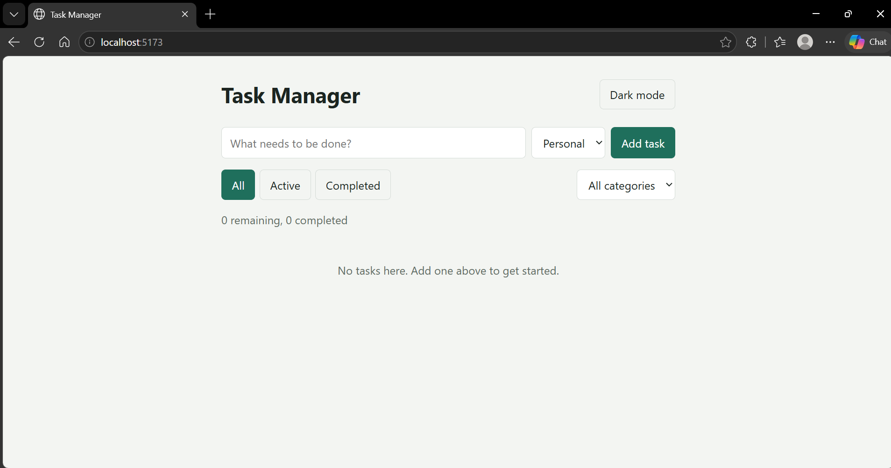
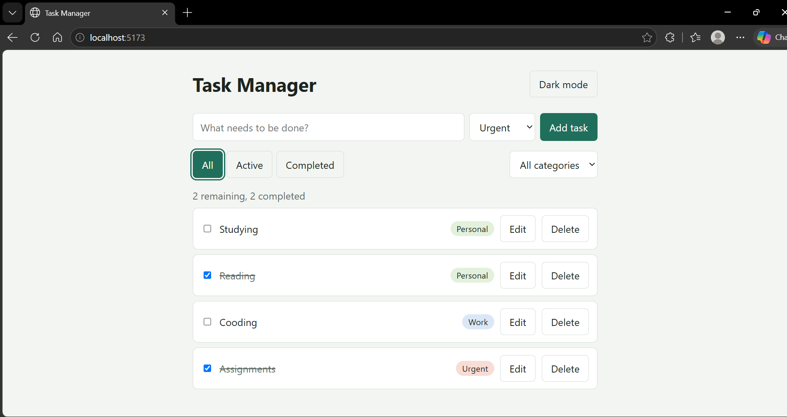
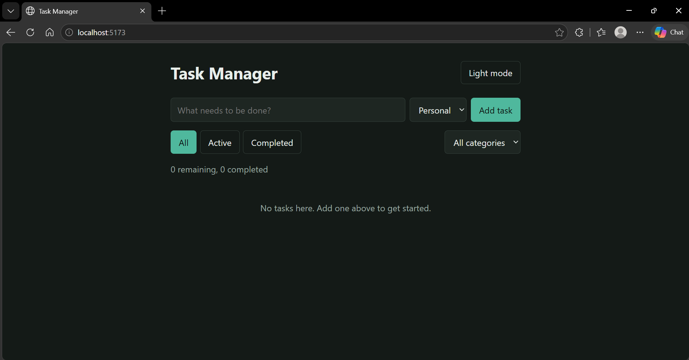
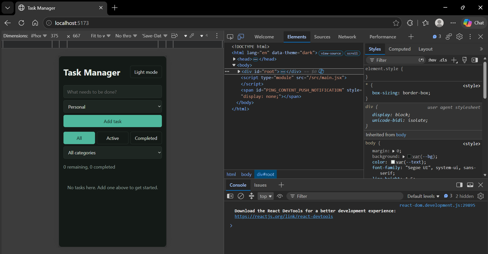

# Task Manager

A single-page task manager built with React. You can add, edit, delete and complete tasks, sort them into categories, filter them by status, and your list is still there after a page refresh.

**Live link:** _add your Vercel/Netlify link here after deploying_

## Features

- Add, edit, delete and mark tasks as complete
- Filter tasks by status (All / Active / Completed)
- Categories for each task (Personal, Work, Urgent) with a category filter
- Live count of remaining and completed tasks
- Tasks saved in localStorage, so they survive a refresh
- Dark / light theme toggle (stretch goal), also saved between visits
- Responsive layout for desktop and mobile

## Technologies

- React 18 (functional components and hooks only)
- Vite
- Plain CSS with CSS variables for theming

## Setup

```
npm install
npm run dev
```

Then open the local address shown in the terminal (usually http://localhost:5173).

To create a production build: `npm run build`.

## Project structure

```
src/
  components/   Header, TaskForm, FilterBar, TaskCounter, TaskList, TaskItem
  hooks/        useLocalStorage.js
  constants.js  category and filter names
  App.jsx       holds the state and passes it down as props
```

## Screenshots

| Desktop | Task lists | Dark mode | Mobile |
|---|---|---|---|
|  |  |  |  |

## Known limitations

- No drag-and-drop reordering or due dates (optional stretch goals not attempted)
- Categories are fixed to three options and cannot be created by the user
- Tasks are stored only in the browser, so they are not shared between devices
